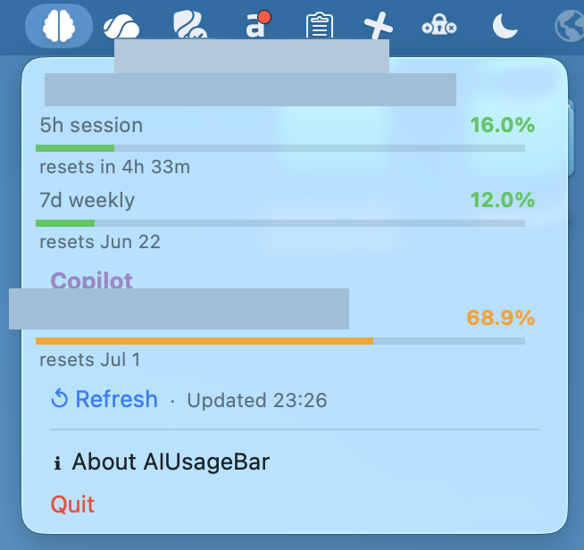
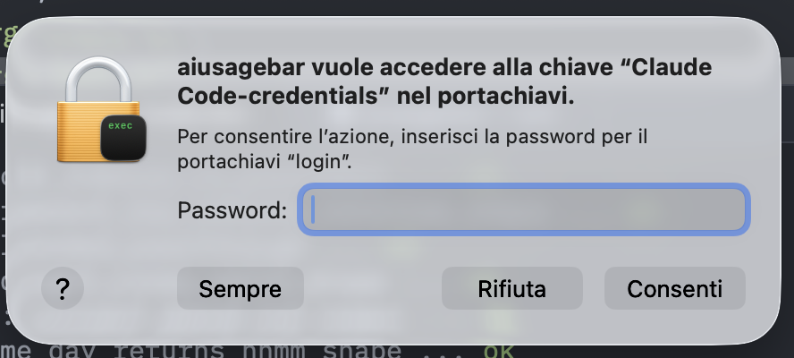
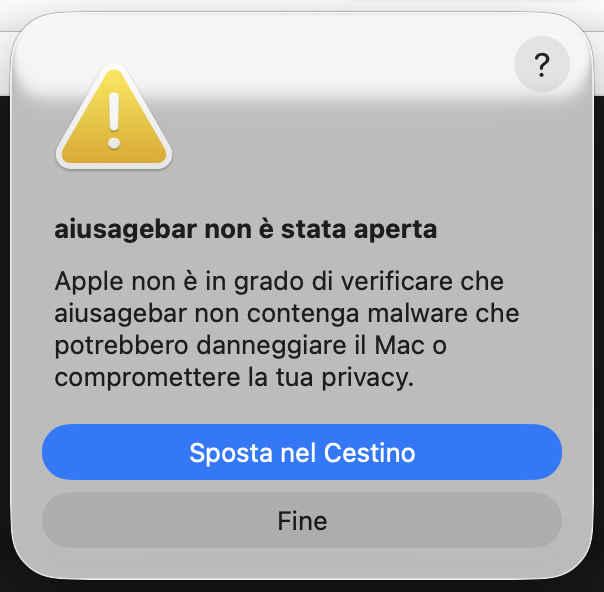

# AIUsageBar

macOS menu bar app that shows AI coding quota usage for **Claude** and **Copilot**.

Read-only monitor. Never sends prompts, never spends quota, never modifies credentials.

[](https://github.com/mttpla/aiusagebar/releases/latest)
[](LICENSE)



---

## Install

Download `aiusagebar-macos-arm64-vX.Y.Z` from the
[Releases page](https://github.com/mttpla/aiusagebar/releases/latest), then:

```bash
chmod +x aiusagebar-macos-arm64-vX.Y.Z
mv aiusagebar-macos-arm64-vX.Y.Z /usr/local/bin/aiusagebar   # or any directory in $PATH
aiusagebar &
```

No Rust toolchain and no Xcode required.

### First launch — Gatekeeper

The binary is unsigned, so macOS blocks it the first time. Launch it once, dismiss
the warning, then open **System Settings → Privacy & Security**, scroll to the
*"aiusagebar was blocked"* row and click **Open Anyway**.


Prefer the terminal? Clear the quarantine flag instead:

```bash
xattr -dr com.apple.quarantine /usr/local/bin/aiusagebar
```

After this the warning never appears again.

---

## Providers

| Provider            | Limit windows                       |
|---------------------|-------------------------------------|
| Claude (Pro / Max)  | 5h session · 7d weekly              |
| Claude (Enterprise) | Spend (dollar budget used / limit)  |
| Copilot             | Monthly premium quota (per account) |

The Claude row adapts to the account type. **Pro / Max** plans report two
rolling utilization windows (`5h session`, `7d weekly`). **Enterprise** plans
don't expose those windows — instead they report a `Spend` budget, so AIUsageBar
shows dollars used against the dollar limit. The plan label shown in the menu is
derived from the account's `organization_type`.

Per-provider states: **Not configured** · **Stale** (renew via official client) · **OK** · **Error**.

---

## Configuration

Copilot needs a GitHub token. AIUsageBar looks for one in this priority order:

1. `COPILOT_GITHUB_TOKEN` (recommended — a fine-grained PAT)
2. `GH_TOKEN`
3. `GITHUB_TOKEN`
4. Keychain item `copilot-cli`
5. `~/.copilot/config.json`
6. `~/.config/gh/hosts.yml`

To avoid the Copilot Keychain prompt, export a PAT before launching:

```bash
export COPILOT_GITHUB_TOKEN=github_pat_...
```

Claude needs no configuration beyond the `claude` CLI being logged in.

---

## Icons

Icons by [Font Awesome](https://fontawesome.com) (CC BY 4.0).

| Tray icon | Meaning |
|---|---|
| Brain (white) | All AI usage under 80% |
| Brain + red dot | At least one provider at or above 80% usage |
| Brain (grey dot) | Data unavailable — not configured, stale, or fetch error |

---

## Keychain access

**Why:** macOS sandboxes Keychain items per creating app. AIUsageBar is not
Claude Code, so reading Claude's stored OAuth token requires your explicit
consent. The first read triggers a system dialog — click **Always Allow** once.



**What:** only the Claude OAuth access token (Keychain item service
`Claude Code-credentials`, account = your macOS username, JSON value with
`claudeAiOauth.accessToken`). Fallback if the Keychain item is unavailable:
`~/.claude/.credentials.json` (created by Claude Code).

**Where it never goes:** the token is never written, never logged, and never
sent anywhere except `api.anthropic.com` for the documented usage/profile
endpoints.

---

## Troubleshooting

### "aiusagebar can't be opened" (only **Move to Trash**)

If you double-click the binary, macOS shows a dead-end dialog with just **Move to
Trash** and **Done** — no way to open it.



**Do not click Move to Trash.** Click **Done**, then unblock the binary using either
path from [First launch — Gatekeeper](#first-launch--gatekeeper): **System Settings →
Privacy & Security → Open Anyway**, or `xattr -dr com.apple.quarantine <path>`.

### Reporting a provider error

If a provider row shows an error, open **Other ▶ Diagnostics ▶ Copy diagnostic log**
to copy the full diagnostic log to your clipboard. Paste it into a GitHub issue or email
when reporting a bug. The Diagnostics submenu is hidden when there is nothing to report.

---

## Requirements

- macOS 11+
- At least one provider configured: the `claude` CLI logged in, or a Copilot PAT / `gh` login

---

## Development

> Skip this section if you installed the binary from Releases.

**Prerequisites:** Rust 1.75+ (`rustup update`).

### One-time setup (per machine)

**1. Create a self-signed code-signing certificate**

This prevents macOS from re-prompting for Keychain access on every recompile.

1. Open **Keychain Access** → menu bar: **Keychain Access → Certificate Assistant → Create a Certificate…**
2. Fill in:
   - **Name:** `AiUsageBar Dev` ← exact, case-sensitive
   - **Identity Type:** Self Signed Root
   - **Certificate Type:** Code Signing
3. Click **Create** → **Done**

The cert stays in your login keychain and is never committed to the repo.

**2. Run `make dev` for the first time**

```bash
make dev
```

macOS will prompt twice:
- *"codesign wants to access key 'AiUsageBar Dev'"* → enter your macOS password, click **Allow**
- *"aiusagebar wants to access 'Claude Code-credentials'"* → click **Always Allow**

From this point on, `make dev` starts the app with no dialogs.

### Daily workflow

```bash
make dev                 # build + sign + run (no Keychain prompts)
cargo build --release    # release binary
cargo check              # fast type-check
cargo clippy             # lint
```

### Releasing a new version

**Prerequisites:** `git-cliff` and the GitHub CLI on PATH.

```bash
brew install git-cliff gh   # once
```

From the repo root, on a clean `master` in sync with `origin`:

```bash
./scripts/release.sh patch   # 0.1.0 → 0.1.1
./scripts/release.sh minor   # 0.1.0 → 0.2.0
./scripts/release.sh major   # 0.1.0 → 1.0.0
```

The script:
1. Runs preflight checks (branch `master`, clean tree, synced with origin, tag unused)
2. Runs the quality gate (`cargo clippy -- -D warnings` and `cargo test`)
3. Bumps the version in `Cargo.toml`, syncs `Cargo.lock`, and regenerates `CHANGELOG.md`
4. Commits (`chore(release): vX.Y.Z`) and creates the annotated tag
5. Prompts to push — on confirm: pushes `master` + tag, builds the release binary, ad-hoc-signs it, packages `dist/aiusagebar-macos-arm64-vX.Y.Z`, and creates the GitHub release with the binary attached

If you decline the push prompt, the script prints the exact build / sign / `gh release create` commands to run manually later.

---

## License

Released under the MIT License. See [LICENSE](LICENSE).
